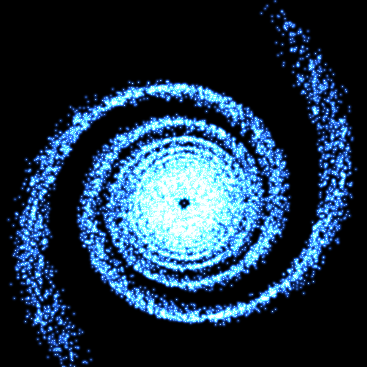
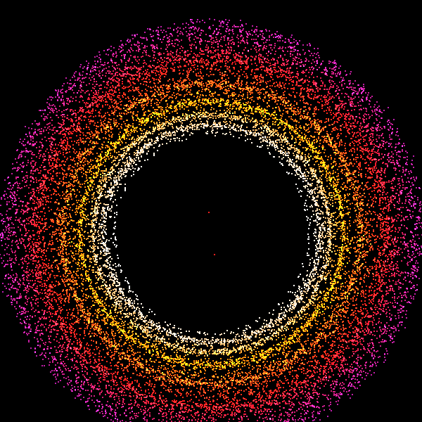
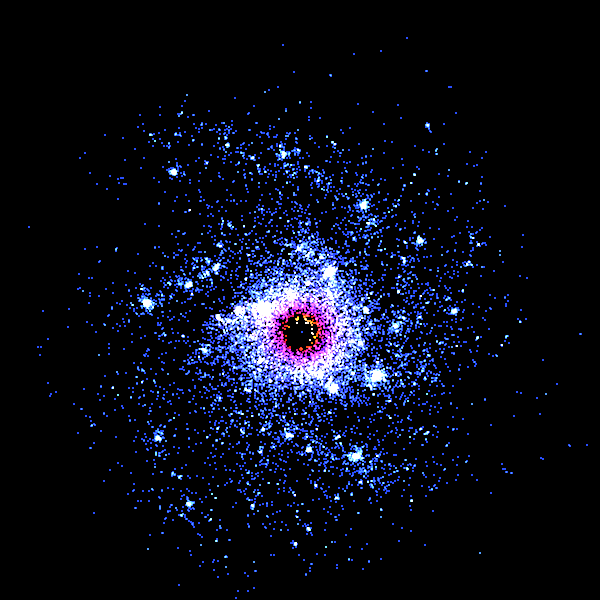

# N Body Particle Simulation

  

  Real time 2D gravitational N body simulation written in C++ with Raylib.

  
  
  
  

---

## Overview

The simulation implements two different approaches to calculating gravitational forces, three numerical integration methods and several initial particle configurations, with plans to add more in the future.

This makes it possible to compare the computational cost (performance wise) and behaviour of different algorithms within the same simulation.

The application also includes an interactive interface for switching between algorithms, integrators and particle configurations allowing combinations of different settings.

---

## Features

- Pairwise force calculation
- Barnes Hut algorithm using a quadtree data structure
- Euler, Verlet and RK4 integration
- OpenMP parallelisation for improved performance
- Multiple particle configurations (Galaxy, Single Star System and Binary Star System)
- Particle visualisation using Raylib
- Particle colouring depending on particle velocities
- User Interface with ability to enable and disable statistics
- CMake builds project into an exe file

---

# Particle Configurations

## Galaxy

A central massive body is surrounded by particles with tangential velocities, producing an orbiting galaxy with spiral arms.

  

---

## Binary Star System

Two high mass bodies orbit their centre of mass while surrounding smaller mass particles respond to their combined gravitational field.

  

---

## Single Star System

A massive central body is surrounded by particles with tangential orbital velocities.

Particles closer to the centre have higher initial orbital velocities, producing a star with a band of particles surrounding the central mass.

  

---

# Gravitational Algorithms

## Pairwise N-Body

The direct approach calculates the gravitational interaction between particles individually.
For N particles, this gives an approximate computational time complexity of O(N²).
This means that increasing the number of particles causes the number of force calculations to grow proportional to N²
The pairwise algorithm allows for comparing the Barnes-Hut implementation on total particles and performance metrics.

---

## Barnes-Hut

The Barnes-Hut implementation uses a quadtree to divide the 2D simulation space into equal square regions.

Rather than calculating the gravitational influence of every individual distant particle, groups of particles can be approximated using their combined mass and centre of mass.

This approximation's tolerance can be adjusted by changing the theta value.

This reduces the algorithm time complexity from O(N²) to O(N log N) which is signinficantly better for high numbers of particles.

---

# Numerical Integration

The simulation currently uses three numerical integration methods: Euler, Verlet and RK4. They differ in accuracy and computational cost as follows

- **Euler:** First order method with one force evaluation per step. Low computational cost but lower numerical accuracy. Works well as a baseline for comparing the integration methods
- **Verlet:** Second order method with approximately one force evaluation per step excluding the start. Provides improved stability and accuracy with similar low calculation cost to Euler.
- **RK4:** Fourth order method requiring four force evaluations per step. Higher computational cost but greater numerical accuracy compared to Euler and Verlet.

## Euler

Euler is the simplest integration method used by the simulation. 

Each timestep requires a single acceleration calculation before updating particle velocity and position.

This gives Euler a low computational cost, but it is only first order accurate and can gain error over longer simulations in a short time span especially for close particle interactions of high mass.

## Verlet

Verlet provides improved numerical behaviour while maintaining a similar cost to Euler.

The implementation uses particle positions from the current and previous timesteps to determine the next position.

Compared with RK4, Verlet requires approximately 3 less calculations per particle per timestep while providing better long term behaviour than Euler integration.

## Runge-Kutta 4 (RK4)

RK4 4th order integration evaluates the system four times during each timestep requiring virtual stores of the particle states.

For an N body simulation, this means the gravitational acceleration must be calculated approximately four times for each integration step for every particle.

The additional computation has fourth order accuracy, which  allows RK4 to achieve high numerical accuracy for a similar timestep to Euler and Verlet.

## Computational Trade-off

The choice of integrator affects both the numerical behaviour and computational cost of the simulation.

For example, when using the pairwise algorithm, a single Euler timestep requires approximately one set of O(N²) force calculations, while RK4 requires approximately four sets of O(N²) force calculations.

Combining this with Barnes-Hut gives another trade-off:

- Pairwise + Euler: O(N²) with 1 force evaluation
- Pairwise + RK4: O(N²) with 4 force evaluations
- Barnes-Hut + Euler: O(N log N) with 1 force evaluation
- Barnes-Hut + RK4: O(N log N) with 4 force evaluations

This allows the simulation to demonstrate how both the choice of force algorithm and numerical integrator affect computational workload.

---

# Parallel Computation

OpenMP is used to parallelise suitable particle calculations.

Where OpenMP is available, independent particle calculations can be distributed across multiple CPU threads.

OpenMP is optional, so the simulation can still be built and run without it.

Also the project uses Eigen (A third party linear algebra module) which allows for particle calculations with vectors.

---

# Rendering

Raylib is used for rendering the particles, drawing the user interface and displaying statistics.

Particles are rendered using low level quad rendering with additive blending to create a dense particle effect.

Particle colour is determined from velocity, allowing differences in particle speed to be visualised directly.

---

# Technology

- C++17
- Raylib 5.5
- Eigen
- CMake 3.20+
- OpenMP
- Git

---

# Project Structure

<pre>
particlesim/
│
├── src/
│   ├── main.cpp
│   │
│   ├── assets/
│   │   ├── calibri.ttf
│   │   ├── inter.ttf
│   │   ├── Galaxy.png
│   │   ├── BinaryStarSystem.png
│   │   ├── StarSystem.png
│   │   └── Galaxy.gif
│   │
│   ├── userinterface/
│   │   ├── ui.hpp
│   │   ├── ui.cpp
│   │   ├── button.hpp
│   │   └── button.cpp
│   │
│   ├── statistics/
│   │   ├── statistics.hpp
│   │   └── statistics.cpp
│   │
│   ├── particlestate/
│   │   ├── ParticlesState.hpp
│   │   └── ParticlesState.cpp
│   │
│   ├── pairwise_algorithm/
│   │   ├── pairwise.hpp
│   │   └── pairwise.cpp
│   │
│   ├── barneshut_algorithm/
│   │   ├── barneshut.hpp
│   │   ├── barneshut.cpp
│   │   ├── node.hpp
│   │   ├── node.cpp
│   │   ├── quadtree.hpp
│   │   └── quadtree.cpp
│   │
│   └── integrator/
│       ├── Euler.hpp
│       ├── Euler.cpp
│       ├── Verlet.hpp
│       ├── Verlet.cpp
│       ├── RK4.hpp
│       └── RK4.cpp
│
├── third_party/
│   └── Eigen/
│
├── CMakeLists.txt
└── README.md
</pre>

---

# Building

## Requirements

- C++17 compatible compiler
- CMake 3.20 or newer
- Git
- OpenMP (optional)

Raylib is downloaded and configured automatically by CMake.

Eigen is included in the project's `third_party` directory.

## Clone

    git clone https://github.com/dmccdev/particlesim.git
    cd particlesim

## Configure

    cmake -S . -B build

CMake will automatically download and configure Raylib.

## Build

    cmake --build build

## Run

### Windows

For a Debug build:

    build\Debug\particlesim.exe

For a Release build: (Recomended)

    build\Release\particlesim.exe

### Linux

    ./build/particlesim

---

# CMake Dependency Management

Raylib is managed through CMake `FetchContent`.

The project therefore does not depend on a hard-coded local Raylib installation path.

A fresh clone can configure the project using:

    cmake -S . -B build

CMake will download Raylib as part of the configuration process.

---

# Performance

Performance is affected by both the gravitational force algorithm and the numerical integrator.

The direct pairwise approach has approximately O(N²) complexity, while Barnes Hut reduces the approximate complexity to O(N log N) by grouping distant particles.

The integrator also affects the amount of work performed per timestep:

- Euler requires one force evaluation.
- Verlet has relatively low computational overhead.
- RK4 requires four force evaluations.

OpenMP can further reduce computation time by distributing independent particle calculations using threading.

The project therefore provides several combinations of algorithms that can be compared under the matching simulation conditions.

---

# Controls

The interface provides controls for selecting:

### Gravitational Algorithm

- Pairwise
- Barnes-Hut

### Integrator

- Euler
- Verlet
- RK4

### Particle Configuration

- Galaxy
- Binary Star System
- Single Star System

The simulation can then be started using the start control.

---

# Potential Future Improvements

- GPU-based force calculations
- CUDA/OpenCL
- Particle trails
- Elastic collisions
- Runtime simulation parameters
- Greater number of particles
- More algorithms, integrators and particle configurations
