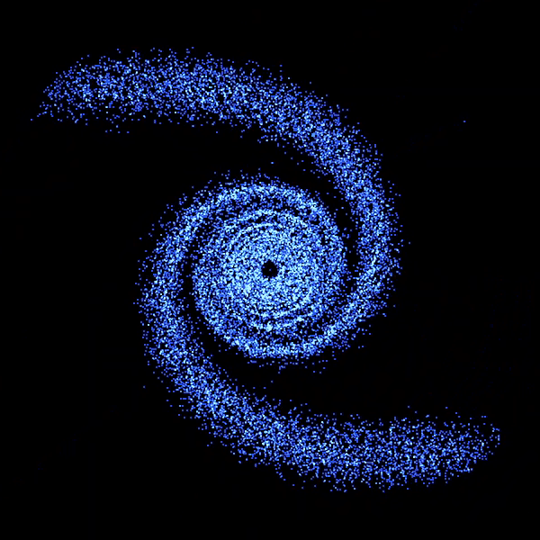

# N-Body Particle Simulation

  

  Real-time 2D gravitational N-body simulation written in C++ with Raylib.

  
  
  
  

---

## Overview

A real-time 2D N-body simulation that models gravitational interactions between particles.

The simulation implements two different approaches to calculating gravitational forces, three numerical integration methods and several initial particle configurations. This makes it possible to compare the computational cost and behaviour of different algorithms within the same simulation.

The application also includes an interactive interface for switching between algorithms, integrators and particle configurations.

  

---

## Features

- Real-time 2D gravitational N-body simulation
- Direct pairwise force calculation
- Barnes-Hut algorithm using a quadtree
- Euler, Verlet and RK4 integration
- Optional OpenMP parallelisation
- Multiple particle configurations
- Real-time particle visualisation
- Velocity-based particle colouring
- Additive particle rendering
- Interactive user interface
- CMake-based build system

---

# Particle Configurations

## Galaxy

A central massive body is surrounded by particles with initial tangential velocities, producing an orbiting galaxy-like structure.

  

---

## Binary Star System

Two massive bodies orbit their common centre of mass while surrounding particles respond to their combined gravitational field.

  

---

## Single Star System

A massive central body is surrounded by particles with tangential orbital velocities.

Particles closer to the centre have higher initial orbital velocities, producing a dense rotating particle system.

  

---

# Gravitational Algorithms

## Pairwise N-Body

The direct approach calculates the gravitational interaction between particles individually.

For `N` particles, this gives an approximate computational complexity of `O(N²)`.

This means that increasing the number of particles causes the number of force calculations to grow rapidly.

The pairwise implementation provides a direct solution and a baseline for comparing the Barnes-Hut implementation.

---

## Barnes-Hut

The Barnes-Hut implementation uses a quadtree to divide the simulation space into regions.

Rather than calculating the gravitational influence of every individual distant particle, groups of particles can be approximated using their combined mass and centre of mass.

This reduces the approximate computational complexity from `O(N²)` to `O(N log N)`.

The reduction becomes increasingly significant as the number of particles increases.

---

# Numerical Integration

The simulation supports three numerical integration methods. Each method has a different computational cost and level of numerical accuracy.

| Integrator | Force evaluations | Order | Computational cost |
|---|---:|---:|---|
| Euler | 1 | 1st | Low |
| Verlet | ~1 | 2nd | Low |
| RK4 | 4 | 4th | High |

## Euler

Euler is the simplest integration method used by the simulation.

Each timestep requires a single acceleration calculation before updating particle velocity and position.

This gives Euler a low computational cost, but it is only first-order accurate and can accumulate significant numerical error over longer simulations.

## Verlet

Verlet provides improved numerical behaviour while maintaining relatively low computational overhead.

The implementation uses particle positions from the current and previous timesteps to determine the next position.

Compared with RK4, Verlet requires substantially less computation per timestep while providing better long-term behaviour than basic Euler integration for many physical simulations.

## RK4

Runge-Kutta 4th order integration evaluates the system four times during each timestep.

For an N-body simulation, this means the gravitational acceleration must be calculated approximately four times for each integration step.

This makes RK4 considerably more computationally expensive than Euler or Verlet.

The additional computation provides fourth-order accuracy, allowing RK4 to achieve high numerical accuracy for a given timestep.

## Computational Trade-off

The choice of integrator affects both the numerical behaviour and computational cost of the simulation.

For example, when using the pairwise algorithm, a single Euler timestep requires approximately one set of `O(N²)` force calculations, while RK4 requires approximately four sets of `O(N²)` force calculations.

Combining this with Barnes-Hut gives another trade-off:

- Pairwise + Euler: `O(N²)` with 1 force evaluation
- Pairwise + RK4: `O(N²)` with 4 force evaluations
- Barnes-Hut + Euler: `O(N log N)` with 1 force evaluation
- Barnes-Hut + RK4: `O(N log N)` with 4 force evaluations

This allows the simulation to demonstrate how both the choice of force algorithm and numerical integrator affect computational workload.

---

# Parallelisation

OpenMP is used to parallelise suitable particle calculations.

Where OpenMP is available, independent particle calculations can be distributed across multiple CPU threads.

OpenMP is optional, so the simulation can still be built and run without it.

---

# Rendering

Raylib is used for real-time rendering.

Particles are rendered using low-level quad rendering with additive blending to create a dense particle-field effect.

Particle colour is determined from simulation data such as velocity, allowing differences in particle speed to be visualised directly.

---

# Technology

- C++17
- Raylib 5.5
- Eigen
- CMake 3.20+
- OpenMP
- Git

---

# Project Structure

<pre>
particlesim/
│
├── src/
│   ├── main.cpp
│   ├── calibri.ttf
│   │
│   ├── assets/
│   │   ├── galaxy.png
│   │   ├── Galaxy.gif
│   │   ├── binary-star.png
│   │   └── singlestar.png
│   │
│   ├── userinterface/
│   │   ├── ui.hpp
│   │   ├── ui.cpp
│   │   ├── button.hpp
│   │   └── button.cpp
│   │
│   ├── particlestate/
│   │   ├── ParticlesState.hpp
│   │   └── ParticlesState.cpp
│   │
│   ├── pairwise_algorithm/
│   │   ├── pairwise.hpp
│   │   └── pairwise.cpp
│   │
│   ├── barneshut_algorithm/
│   │   ├── barneshut.hpp
│   │   ├── barneshut.cpp
│   │   ├── node.hpp
│   │   ├── node.cpp
│   │   ├── quadtree.hpp
│   │   └── quadtree.cpp
│   │
│   └── integrator/
│       ├── Euler.hpp
│       ├── Euler.cpp
│       ├── Verlet.hpp
│       ├── Verlet.cpp
│       ├── RK4.hpp
│       └── RK4.cpp
│
├── third_party/
│   └── Eigen/
│
├── CMakeLists.txt
└── README.md
</pre>

---

# Building

## Requirements

- C++17 compatible compiler
- CMake 3.20 or newer
- Git
- OpenMP (optional)

Raylib is downloaded and configured automatically by CMake.

Eigen is included in the project's `third_party` directory.

## Clone

    git clone https://github.com/YOUR_USERNAME/particlesim.git
    cd particlesim

Replace `YOUR_USERNAME` with your GitHub username.

## Configure

    cmake -S . -B build

CMake will automatically download and configure Raylib.

## Build

    cmake --build build

## Run

### Windows

For a Debug build:

    build\Debug\particlesim.exe

For a Release build:

    build\Release\particlesim.exe

### Linux

    ./build/particlesim

---

# CMake Dependency Management

Raylib is managed through CMake `FetchContent`.

The project therefore does not depend on a hard-coded local Raylib installation path.

A fresh clone can configure the project using:

    cmake -S . -B build

CMake will download Raylib as part of the configuration process.

---

# Performance

Performance is affected by both the gravitational force algorithm and the numerical integrator.

The direct pairwise approach has approximately `O(N²)` complexity, while Barnes-Hut reduces the approximate complexity to `O(N log N)` by grouping distant particles.

The integrator also affects the amount of work performed per timestep:

- Euler requires one force evaluation.
- Verlet has relatively low computational overhead.
- RK4 requires four force evaluations.

OpenMP can further reduce computation time by distributing independent particle calculations across CPU threads.

The project therefore provides several combinations of algorithms that can be compared under the same simulation conditions.

---

# Controls

The interface provides controls for selecting:

### Gravitational Algorithm

- Pairwise
- Barnes-Hut

### Integrator

- Euler
- Verlet
- RK4

### Particle Configuration

- Galaxy
- Binary Star System
- Single Star System

The simulation can then be started using the start control.

---

# Physics

The simulation uses Newtonian gravitational mechanics to calculate particle acceleration.

Initial positions, masses and velocities are configured differently for each particle configuration.

For the galaxy and single-star systems, particles are assigned tangential velocities based on their distance from the central mass.

The binary system uses two massive bodies with opposing velocities so that they orbit their common centre of mass.

---

# Future Improvements

- GPU-based force calculations
- CUDA/OpenCL acceleration
- Particle trails
- Elastic collisions
- Runtime simulation parameters
- Performance statistics
- Larger particle counts
- Additional spatial partitioning techniques
- More advanced gravitational visualisation
